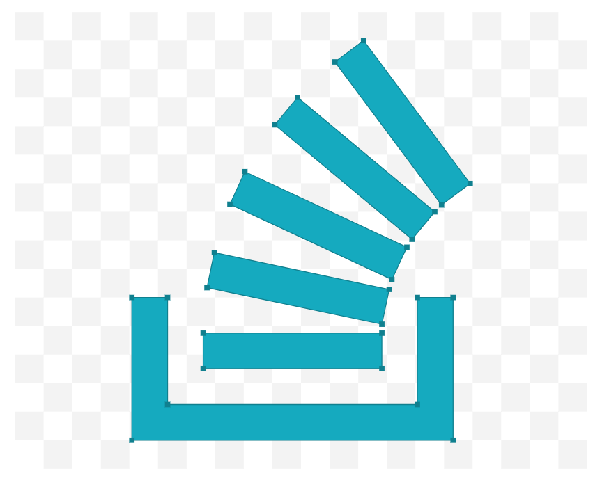

   
  

   </a>
  

   
  

    
    
    
    
  

Hi there ! I'm a  developer who loves JS, web development , java , c++ and many more !

❤️ Support me
All my donations will be used to finance my projects. Make a donation on [payPal](https://paypal.me/thomaszv?locale.x=en_US), or Buy me a [coffe]().

🔭 I’m currently working on 

Many small modules. A multifunctional bot with a dashboard. And some other projects...

🏆 My most famous project 

discord bot over 2,050  servers !

Web that will guide you on easy way to build the dream website 

🏓 Need help on one of my projects ?
Join the support server by clicking [here](https://discord.gg/nERQmYafqQ).

      

